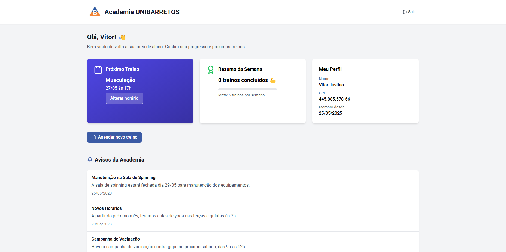

# 🏋️‍♂️ Academia UNIBARRETOS - Dashboard de Alunos

Este é um painel de controle para alunos da **Academia UNIBARRETOS**, desenvolvido em **React** com **TypeScript**, focado em fornecer uma experiência interativa e organizada para visualização de treinos, progresso semanal e avisos da academia.

## ✨ Funcionalidades

- 👤 Login e autenticação de alunos
- 📅 Visualização e agendamento de treinos
- 📈 Resumo semanal de treinos concluídos
- 🔔 Avisos e comunicados importantes da academia
- 🧾 Informações do perfil do aluno (nome, CPF, data de cadastro)

## 🖼️ Demonstração

## 🚀 Tecnologias Utilizadas

- [React](https://reactjs.org/)
- [TypeScript](https://www.typescriptlang.org/)
- [Tailwind CSS](https://tailwindcss.com/)
- [React Router](https://reactrouter.com/)
- [Lucide Icons](https://lucide.dev/)
